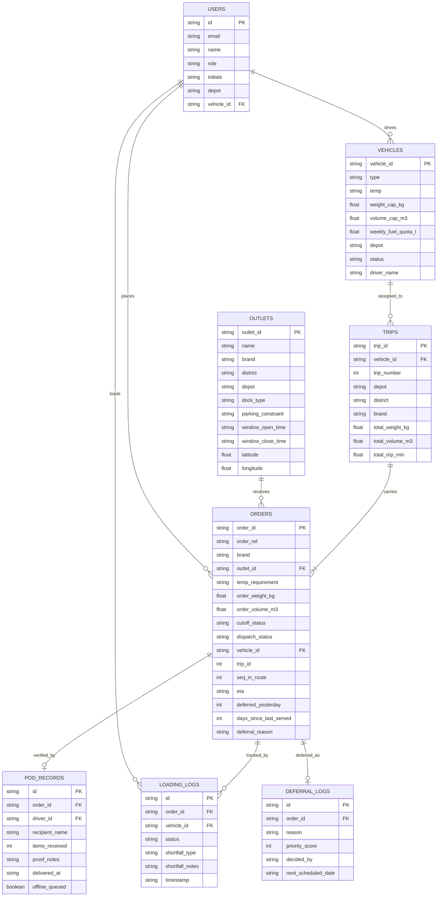

# Waypoint Architecture & Data Model

## 1. System Architecture Diagram

```mermaid
graph TD
    subgraph Client Layer [Client Application - Multi-Role Responsive UI]
        SM[Store Manager Portal<br/>- Order Capture<br/>- 4 PM Cutoff<br/>- ETA & Receipt]
        DISP[Dispatcher Control Room<br/>- 7-Rule Solver<br/>- Fleet Telemetry<br/>- Deferral Audit]
        LOAD[Loader Dock App<br/>- LIFO Reverse Loading<br/>- Checklist & Shortfalls]
        DRV[Driver Mobile App<br/>- Stop Sequence<br/>- Offline POD Capture]
    end

    subgraph Offline Engine [Offline-First & Resilience]
        SW[Service Worker / PWA<br/>Cache-First Shell & Assets]
        IDB[(IndexedDB Storage<br/>Manifests & Offline POD Queue)]
        RECON[Reconciliation Engine<br/>Auto-Sync & Conflict Resolver]
    end

    subgraph Server Layer [Next.js App Router API & Server Layer]
        AUTH_API[/api/auth - Role Auth & Seeded Accounts/]
        ORDER_API[/api/orders - Cutoff & Status Pipeline/]
        PLAN_API[/api/plan - Allocation & Publication/]
        LOAD_API[/api/loading - Reverse Sequences & Shortfalls/]
        DRV_API[/api/driver & /sync - POD & Batch Ingestion/]
        DATA_API[/api/fleet & /api/outlets & /api/seed/]
    end

    subgraph Engine Layer [Algorithmic Core]
        SOLVER[Constraint Satisfaction Solver<br/>Priority-Weighted Multi-Depot Knapsack]
        VALIDATOR[Feasibility Validator<br/>Strict 7-Rule Verification Engine]
        DEGRADE[Degradation Handler<br/>Mall Timeout / Shortfall / Breakdown]
    end

    subgraph Database Layer [ACID Persistence Layer]
        DB[(Waypoint Persistent Store<br/>Users, Outlets, Vehicles, Orders,<br/>Trips, Logs, PODs, Deferrals)]
    end

    SM -->|Order Placement / Cutoff| ORDER_API
    DISP -->|Run Solver & Publish| PLAN_API
    LOAD -->|Reverse Load & Shortfall| LOAD_API
    DRV -->|Online POD| DRV_API
    DRV -.->|Signal Drop| IDB
    IDB -->|Network Restored| RECON
    RECON -->|Batch Sync /api/driver/sync| DRV_API
    SW --> Client Layer

    PLAN_API --> SOLVER
    SOLVER --> VALIDATOR
    PLAN_API --> DEGRADE

    ORDER_API --> DB
    PLAN_API --> DB
    LOAD_API --> DB
    DRV_API --> DB
    DATA_API --> DB
    AUTH_API --> DB
```

---

## 2. Component & Layer Breakdown

### A. Presentation Layer (Multi-Role Responsive UI)
- **Store Manager**: Places daily/weekly orders, receives 4 PM cutoff alerts, tracks live ETAs, and confirms deliveries.
- **Dispatcher**: Monitors island-wide network operations, resolves capacity constraints via automated solver, enforces feasibility rules, and inspects route telemetry.
- **Loader**: Tablet/phone dock interface displaying reverse loading order (LIFO), inspection checklists, and pre-departure shortfall logging.
- **Driver**: Mobile phone interface with turn-by-turn stop sequences, offline POD capture (recipient name, quantity, proof notes), and automatic reconnection sync.

### B. Algorithmic Optimization & Feasibility Engine
- **Constraint Validator**: Mathematically validates all 7 feasibility rules:
  1. *Brand & District Isolation*: Single brand & district per trip.
  2. *Refrigeration*: Chilled goods allocated exclusively to reefer fleet.
  3. *Vehicle Access*: Outlets with `van_only` access allocated exclusively to vans.
  4. *Home Depot*: Peliyagoda vehicles serve Western/Southern/North-Western outlets; Kandy vehicles serve Central/Highland outlets.
  5. *Whole Orders*: No fractional order splitting across trips.
  6. *Capacity Caps*: Trip weight $\le$ `weight_cap_kg` and volume $\le$ `volume_cap_m3`.
  7. *Trips & Time Budgets*: Max 2 trips; Fresh morning $\le 270$ min; Style/Tech trading day $\le 480$ min.
- **Automated Solver**: Multi-strategy bin-packing heuristic with starvation protection for previously deferred outlets (`deferred_yesterday = 1`).

### C. Offline-First Resilience & Reconciliation
- **IndexedDB & Service Worker**: Caches driver manifests and queues POD captures locally when mobile coverage drops in dead zones.
- **Reconciliation Engine**: Ingests offline queues upon network restoration, performs conflict resolution, and updates server state idempotently.

---

## 3. Data Model & Entity Relationship Schema


