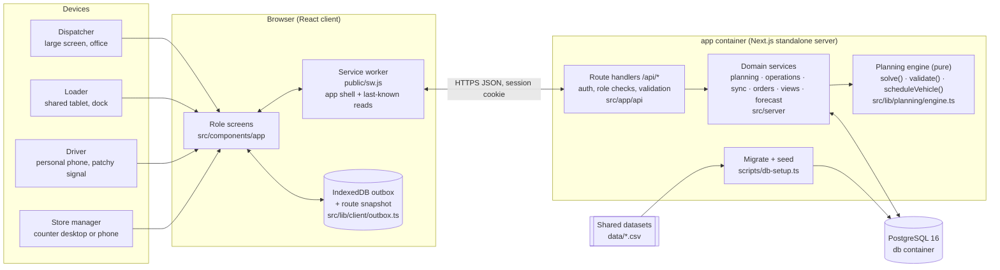

# Architecture

Waypoint is one Next.js 16 application backed by PostgreSQL 16. The same deployable unit serves the role screens (React, client-rendered after a server-side session check) and a JSON API (route handlers). A pure TypeScript planning engine sits between the API and the database. `docker compose up` runs two containers: `db` and `app`.

## Component diagram



## Request flow for one order

```mermaid
sequenceDiagram
  autonumber
  participant SM as Store manager
  participant API as API
  participant ENG as Engine
  participant DB as PostgreSQL
  participant DP as Dispatcher
  participant LD as Loader
  participant DR as Driver (offline-capable)

  SM->>API: POST /api/orders
  API->>DB: insert order, run = first open run before 16:00 cutoff
  API-->>SM: order id + run date (confirmation)
  DP->>API: POST /api/dispatch/close, POST /api/plans
  API->>ENG: solve(orders, fleet, outlets, travel, fuel)
  ENG-->>API: trips + stops + deferrals with reasons (0 violations)
  API->>DB: draft plan
  DP->>API: POST /api/plans/:id/edit (manual move/defer)
  API->>ENG: validate(edited allocation)
  ENG-->>API: violations → 422, or accepted
  DP->>API: POST /api/plans/:id/publish
  API->>DB: plan published, deferred orders moved to next run, events for every role
  LD->>API: check loads in reverse stop order, report shortfall (holds vehicle)
  DP->>API: resolve shortfall (proceed / remove order)
  LD->>API: mark ready
  DR->>DR: depart, deliver with photo + signature → IndexedDB outbox
  DR->>API: POST /api/sync (batch, client_event_id per event)
  API->>DB: apply idempotently; conflicts kept as extra proofs + issue
  SM->>API: confirm receipt or report short/damaged
```

## Main components

| Component | Location | Responsibility |
| --- | --- | --- |
| Role screens | `src/components/app/*` | Dispatcher workspace (overview, planner, orders, fleet, outlets, capacity, issues), loader dock, driver route, store portal. Same visual system as the Designathon design (`globals.css`), additions in `ops.css`. |
| API | `src/app/api/**/route.ts` | Thin handlers: authenticate, check role, parse and validate input, call a service. Errors return `{ error, details }` with proper status codes; constraint violations return 422 with the broken rules. |
| Session | `src/server/passwords.ts`, `src/server/http.ts` | scrypt password hashes; HMAC-signed, HttpOnly session cookie. Every handler calls `requireUser(...roles)`; data is scoped to the user's depot, vehicle or outlet in SQL. |
| Planning engine | `src/lib/planning/engine.ts` | Pure functions, no I/O. `solve` builds an allocation; `validate` checks any allocation; `scheduleVehicle` computes stop times, trip minutes, distance and fuel. Shared by API, seed and unit tests. |
| Planning service | `src/server/planning.ts` | Loads engine inputs (fleet availability, weekly fuel already used, carried-over deferrals), stores drafts, applies manual edits through validation, publishes plans and re-decides earlier deferrals when a plan is replaced. |
| Field operations | `src/server/operations.ts` | Loading checks, shortfalls that block departure, release, issue resolution, store receipt. |
| Offline sync | `src/server/sync.ts`, `src/lib/client/outbox.ts`, `public/sw.js` | See below. |
| Read models | `src/server/views.ts` | One query bundle per screen, already filtered to what the viewer may see. |
| Capacity outlook | `src/server/forecast.ts` | Calendar-adjusted weekly demand per depot and brand, converted to vehicle trips and peak-day refrigerated trips against available reefers. |
| Bootstrap | `src/server/schema.ts`, `src/server/seed.ts`, `scripts/db-setup.ts` | Idempotent schema; loads the shared CSVs and the walkthrough day on first start. The dispatcher can restore it from the UI. |

## Planning and allocation engine

**Constraints enforced on every generated plan and every manual change** (booklet pages 5 and 20-21):

| Code | Rule |
| --- | --- |
| R1 | A trip carries one brand to one district |
| R2 | Chilled orders only on reefer vehicles (reefers may carry ambient) |
| R3 | `van_only` outlets only on vans |
| R4 | Vehicles serve only their home depot's outlets |
| R5 | Whole orders; each served once, never split |
| R6 | Trip weight and volume both within the vehicle limits |
| R7 | At most two trips per vehicle; Fresh trips ≤ 270 min (03:30-08:00); Style + Tech ≤ 480 min. Trip time = outbound + inter-stop × (n-1) + Σ service allowance |
| W | Each stop arrives before its delivery window closes; mall windows intersect the outlet window; early arrivals wait |
| F | Route distance (2 × depot-to-district + inter-stop km) ÷ km/L fits the vehicle's remaining weekly fuel quota, after earlier runs in the same ISO week |
| A | Vehicles `in_workshop` are never used |

**Algorithm.** Orders are ranked by a transparent priority: outlets already skipped on earlier runs first, then Fresh chilled, Fresh ambient, Tech, Style, then days waiting, tighter windows and larger orders. Each order is inserted at the cheapest feasible place: an existing trip for the same brand and district (best fit by spare volume), otherwise a new trip on the least specialised compatible vehicle (dry trucks before vans before reefers, so scarce vehicles stay free for orders that need them). Every candidate placement is checked by `scheduleVehicle`, so the output satisfies all rules by construction and is re-validated before saving. Orders that fit nowhere are deferred with a diagnosed reason code (`REEFER_CAPACITY`, `VAN_CAPACITY`, `TIME_BUDGET`, `FUEL_QUOTA`, `WINDOW_UNREACHABLE`, `NO_COMPATIBLE_VEHICLE`, `FLEET_CAPACITY`) and marked unavoidable; dispatcher deferrals are `MANUAL` with the dispatcher's reason. The plan summary names the binding constraints.

**Assisted planning.** The dispatcher can move any order to another vehicle or defer it with a reason; the change is validated against all rules and rejected with the specific violations if it breaks one. Deferred orders move to the next operating run with an incremented skip count, which raises their priority so the same outlet is not skipped twice in a row when avoidable.

## Offline operation and recovery

1. **App shell offline.** The service worker caches the app shell and static assets (cache first) and serves navigations and GET API reads network first with a cached fallback, so a driver or loader can reopen the app with no signal and see the last route.
2. **Durable local records.** The driver screen writes every action (depart, deliver, fail, issue) to an IndexedDB outbox before sending it, with a UUID `client_event_id`, device id and device timestamp. Photos are downscaled on the device. The route itself is snapshotted to IndexedDB.
3. **Optimistic view.** The screen shows server state with unsynchronised records applied on top, labelled "Saved offline · awaiting sync", and prevents completing the same stop twice.
4. **Reconciliation.** When connectivity returns (browser `online` event, a 15 s retry loop, or "Sync now"), the outbox is posted in recorded order to `/api/sync`. The server:
   - stores each applied event in `sync_events`; a replay returns `duplicate` and changes nothing;
   - never overwrites a closed stop: a second, different outcome is stored as an extra proof and raised as a `sync_conflict` issue for the dispatcher, who sees both proofs side by side;
   - keeps records for a replaced plan version and raises them for review;
   - does not store rejections (e.g. vehicle not yet released), so the device can retry them; the driver can also discard them.
5. **Shared devices.** Signing out clears the service-worker cache so the next person on a dock tablet does not see the previous user's data.

The "Work offline" control on the driver screen simulates a coverage gap for demos; real loss of connectivity follows the same path (verified in the e2e test with the browser set offline and a full page reload).

## Security notes

- Passwords are scrypt-hashed; sessions are HMAC-signed HttpOnly cookies (`SESSION_SECRET` is required in production, `COOKIE_SECURE=true` behind HTTPS).
- Authorisation is enforced on the server for every handler and every query is scoped to the user's depot, vehicle or outlet; the client never decides access.
- All SQL is parameterised. Input sizes are bounded (photos ≤ ~900 kB data URL, batches ≤ 200 events).
- `ALLOW_RESET=false` disables the demo reset on a public deployment once judging ends.

## Deployment

The `Dockerfile` builds the Next.js standalone server, then the runtime image runs `node scripts/db-setup.ts` (schema + first-time seed, retrying until the database is ready) before `node server.js`. Any container host with PostgreSQL works (Render, Railway, Fly.io, a VM with Docker Compose); set the variables from `.env.example`.
