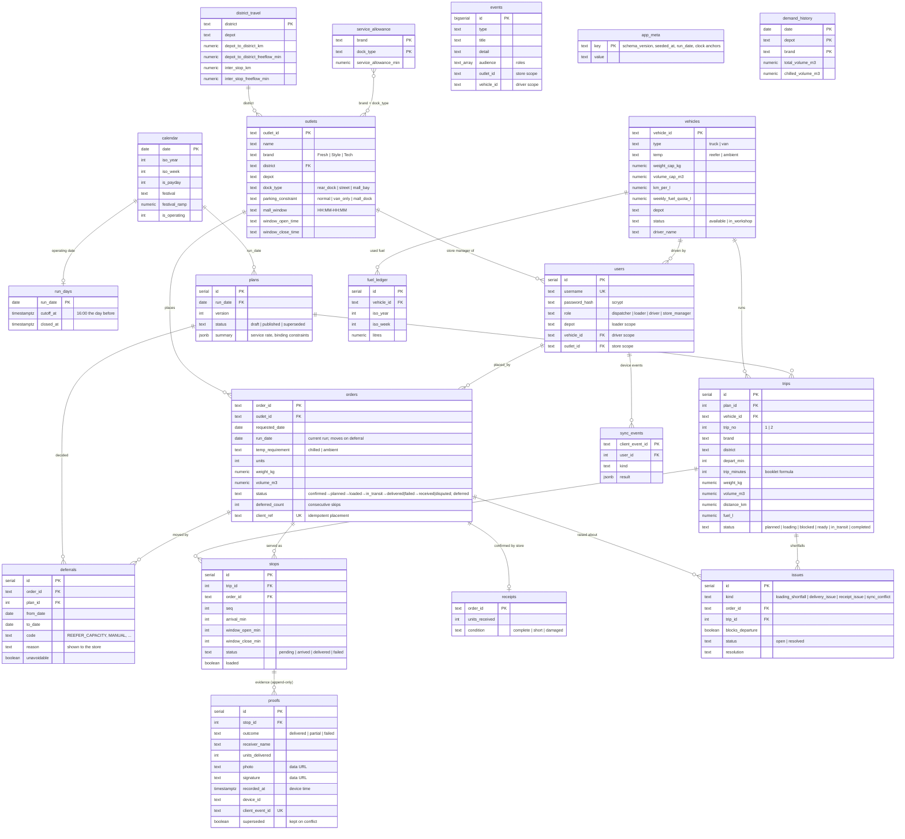

# Data model

PostgreSQL 16. The schema lives in `src/server/schema.ts` and is applied idempotently on every start. Reference tables keep the shared dataset column names so the official CSVs load without mapping.

Image export: [diagrams/data-model.png](diagrams/data-model.png)

## How the data connects

- **One order, one record.** An order is created by the store (or seeded from history) and is the key every role works against: it becomes a `stop` on a `trip` in a published `plan`, gets `proofs` from the driver and a `receipt` from the store. Status on `orders` is the single source the store sees.
- **Plans are versioned.** Regenerating creates a new draft; publishing supersedes the previous version. Loaders see the version they checked against; driver records for a replaced version are kept and flagged.
- **Deferrals are first-class.** Each deferral row records the run it left, the run it moves to, a reason code, the human reason shown to the store and whether it was unavoidable or the dispatcher's choice. `orders.deferred_count` drives fairness in the next plan; the dispatcher overview lists outlets skipped on earlier runs.
- **Fuel quotas are weekly.** Remaining quota = `weekly_fuel_quota_l` − litres in `fuel_ledger` for the ISO week (earlier runs) − fuel of published trips on other days that week.
- **Evidence is append-only.** `proofs` are never updated or deleted by sync; conflicting records are added with `superseded = true` and an `issues` row of kind `sync_conflict`.
- **Notifications are scoped rows.** `events.audience` lists the roles; store, driver and loader events are further filtered by outlet, vehicle and depot in the query.
- **Settings.** `app_meta` holds the schema version, when the data was seeded, the walkthrough run date and the scenario-clock anchor.
- **Reference data = shared datasets.** `outlets`, `vehicles`, `calendar`, `district_travel` and `service_allowance` are loaded from `data/*.csv` with the booklet's column names. `demand_history` is aggregated from `deliveries_train.csv` when present.
